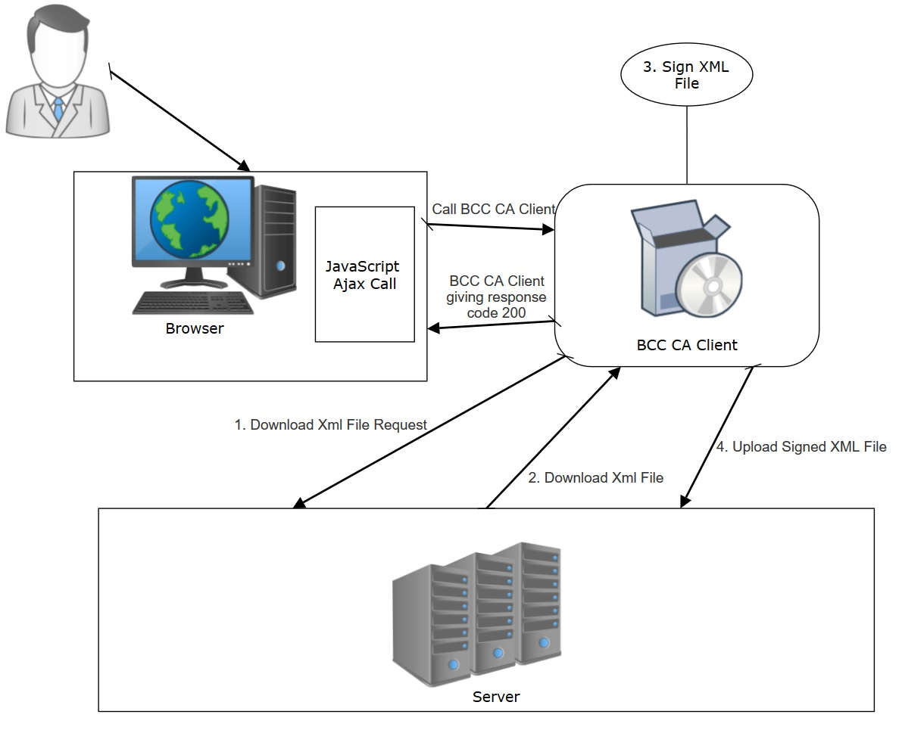

# XML Signing Desktop Client

This is a Desktop client software builld on behalf of [Bangladesh Computer Council (**BCC**)](http://bcc.gov.bd/ "BCC Web") for enabling digital signing to any web forms. The client also embade signing time in the web form with help of Windows NTP server (time.windows.com). It checks client PC time with the NTP server and if client PC time is not correct (if at least ***5 min*** difference from the NTP server), it will not allow users to sign the web form.

## Functionality

This desktop client downloads a XML file, sign the file and upload the file with token based authintication.
The files never stored in disk, it just downloaded as stream, stored on RAM for processing, after being processed, it is uploaded to server.
The web application, using/invoking this app, should provide a file download URL, and file upload url with API.
It is recommanded the file download and upload URL should be short time expired enabled (may be around 5-10 minuites) and secured with token authintication. It is also recommanded that the url should be expired after xml file upload completed.

Demo web app for enabling digital signing in a site-

- [ASP.Net Core](https://github.com/AbrarJahin/XML-Signer-ASP.NetCore-PostGRE "ASP.Net Core Server Example")
- PHP Laravel (*demo coming soon*)
- Java Spring (*demo coming soon*)
- Python Django (*demo coming soon*)

## Use Case

This client software would be used to enable any website use digital signature with [x.5009 certificate](https://en.wikipedia.org/wiki/X.509 "x509 Certificate - Wikipedia").
This client software is a ***cross-site desktop client*** for any website having maintain the described API in this document and call the API in the [mentioned way](#mentioned_way).

## Installation and Deployment

To use the functionality, the desktop client app should be running in client PC, so that the app can be invoked/called from any website via javascript [AJAX call](#AJAX-call) as the client app creates a http server in the client PC by running the app.
As previously mentioned, to enable digital form signing, 2 things are needed-

1. Desktop Client App running in the PC (desktop/laptop)
2. Server having the 2 mentioned API to upload and download file and initiate AJAX call from web page

The server should also be capable of creating xml file from server and retrive data from xml and parse the signed xml file so that the server can easily understand who, when, why sign a file.

## API

The client app needs 2 api enabled in server to work.

1. **Get API** - to download the XML file from server
2. **Post API** - to upload the XML file to server

## Why XML-

We are using XML because-
- Easy to store any data to xml.
- Easy to extract any data from XML and store it to required data format.
- Xml have standerd way of [signing](https://en.wikipedia.org/wiki/XML_Signature "XML Signature wikipedia"), sign verification, 

## XML Serialization and Deserialization

## Testing

## Architecture

The architecture can be described by the following image-

<!---
<object data="./.doc/architecture.pdf" type="application/pdf" width="700px" height="700px">
    <embed src="./.doc/architecture.jpg">
        
This browser does not support PDFs. Please download the PDF to view it: <a href="./.doc/architecture.pdf">Download PDF</a>.

    </embed>
</object>
-->

## Work Flow
